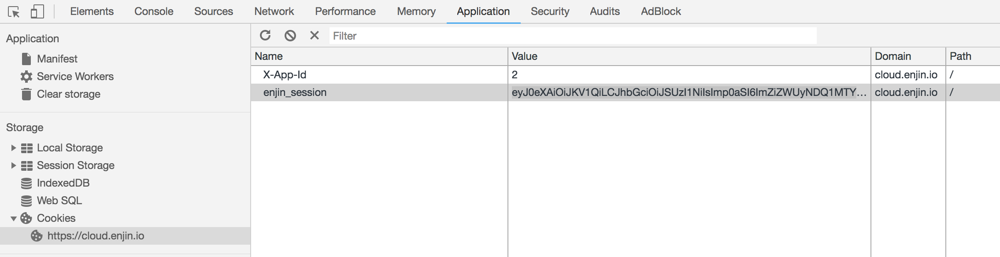

## __“All documents included here are to be considered Work-in-Progress whose contents update on a frequent basis. Do NOT download or copy ANY of the files here. You are entirely responsible for any and all losses (ETH, ENJ, productivity, etc) that result from failing to heed this warning.”__

# Trusted Cloud Introduction

The Trusted Cloud is the main backend service of ENJ that connects your game to the Ethereum network. The TC acts as a hub, gathering requests from clients and game servers, interacting with the smart contracts on Ethereum, and returning data back to your game. It also manages the link between your users game account (i.e. SteamID,
  XBox Live Id, etc), and their blockchain identity (i.e. currently linked wallet address).

The main way to interface with our service is to use GraphQL, either via API or interactively
using a console like GraphiQL. If you are unfamiliar with GraphQL, check out [this introduction](https://graphql.org/learn/) to get started using the language.

There are two separate TC servers, Testnet and Mainnet.

Testnet is a development version of the mainnet, where you can easily obtain fake Ethereum and Enjin Coin to test your items in a safe, simulated environment without using real cryptocurrency.

Mainnet is the real deal. You are using real Ethereum and EnjinCoin, so transactions
here cost real cryptocurrency. You should be very comfortable with your implementation on testnet before doing anything substantial on mainnet.

You can use the following GraphiQL browser interface to interact with the Trusted Cloud:

* **Kovan Trusted Cloud (GraphiQL):** [https://kovan.cloud.enjin.io/graphiql](https://kovan.cloud.enjin.io/graphiql)

## Browsing the Schema
On the right-side there should be a documentation panel to expand and browse for all the requests and parameters you can use. See [here](https://graphql.org/learn/queries/) for documentation on Queries and Mutations. Queries are requests for information from the
server, where Mutations are requests that modify server side data.

## Making a Request
On the (top) left panel, you would enter in your request to be made to the TC. Press the “Play” button at the top to submit that request, and you will receive a response on the right panel, sometimes a notification will appear in your dev wallet to sign a transaction depending on the request made.

## Creating Your User

  If you have not already signed up, you can create a user account directly in GraphiQL with the following mutation:

```
mutation createNewUser{
  CreateEnjinUser (
    name: "USERNAME",
    email: "EMAIL",
    password: "PASSWORD"
  ) {
    id
    name
    email
    access_tokens
  }
}
```

_Accounts are not shared between Kovan & Mainnet TP servers. You will need an account on each server if you want to use both platforms._

If you are an Admin user for an app you can also use the above mutation to create new users for your app, the new user's details will be emailed to the user on creation.

## Login and Authenticating Your Requests
You will need to **authenticate your requests** made via the TC. To authenticate your request, you will need an access token. Use this request to get your access token:

```
query login{
  EnjinOauth (
    email: "MY_ACCOUNT_EMAIL",
    password: "MY_ACCOUNT_PASSWORD"
  ) {
    id,
    name,
    email,
    access_tokens
  }
}
```

In your browser, [Chrome Instructions] open DevTools (F12), navigate to the **“Application”** tab, expand **“Cookies”** on the left panel and select the website. Create a new cookie called `enjin_session` and enter in your `access_token` from the login query as the value (cut and paste the key in quotes).

 If you have an app already you can send its app id in as a separate cookie/header called `X-App-Id`.  Some GraphQL queries and mutations require the app id cookie/header to be set so make sure you always include it.



Once you have set up your **enjin_session** cookie, you can start working with
the platform in the GraphQL console.


## Creating Your App
You will need to create at least one App on the Trusted Cloud. An app is a central
container for all of your items and players. For example your app will appear as one of the “Collections” where your items will appear in the user’s wallet.

```
mutation createApp{
  CreateEnjinApp (
    name: "Doge",
    description: "Much apps. Such wow.",
    image: "/doge.jpg"
  ) {
    id
    name
    description
    image
  }
}
```

One important thing to know is your App ID. If you already created an app, but forget the id, you can look it up with the following query:

```
query apps {
  EnjinApps{
    id,
    name
  }
}
```

You will need a name, description and a link to a hosted image for your app. You should get the App ID in the response if it was successful. You can now use this App ID in your `X-App-Id` cookie. See **Authenticating your Requests** for info about setting this cookie.

## Linking Your Wallet

Every user for your app requires an app identity which links users to your app,
along with their unique wallet address.

Identities are distinct from user ids, and are a way to decouple users from wallet
addresses. Identities are either linked, or unlinked. If they are linked, they
contain a valid Ethereum address. Unlinked identities have a like code like `BXXAZK`.
It is important to know that **there can only be one identity per user, per app/game.**
You cannot directly connect a user id to a wallet.

For example, user `bob` can link
his wallet `0xabcd`to the game `Space Monkies`, but cannot link multiple wallets to
that particular game.  If `bob` wants to use a different wallet with `Space Monkies`,
he will need to unlink the current wallet, and re-link with the new wallet.

An identity will automatically be created for new users if you set an app id in the `X-App-Id` cookie/header when creating the user.

To accept and sign any transactions, you will need to link your Enjin Wallet (Dev version) app to your identity. To do this, you will need to find your **Linking Code**.

You can find the link code with the following query:

```
query viewIdentities{
  EnjinIdentities (
    pagination: {
      page: 1,
      limit: 50
    }
  ) {
    id
    app {
      name
    }
    linking_code
    enj_allowance
    ethereum_address
  }
}
```
You should be given a 6 character linking code to enter into your dev wallet app in the **LINKED APPS** section. Mainnet code starts with “A”, while Kovan starts with “B”. You will need to choose which wallet to link (if you have multiple wallets imported).

To reset your linked app, use the following query and replace the id with your identity_id. You can find this by using the query above.
```
mutation unlinkWallet{
  DeleteEnjinIdentity (
    id: identity_id,
    unlink: true
  ) {
    linking_code
  }
}
```

## Approving ENJ
To prepare for item creation, you will need to pre-approve ENJ to the CryptoItems smart contract.  When linking your wallet for the first time an approve transaction will automatically be created for you to sign.  If you check the **NOTIFICATIONS** section of the wallet you should see and APPROVE ENJ transaction ready to sign.  Accept the transaction request to approve the ENJ.

By default the automatic approval transaction will approve the maximum amount of ENJ possible.  If you wish to change the pre-approval amount you will need to make sure you have set approval to 0 first before approving your actual value (use -1 for max ENJ possible). You do not need to multiply value by 10^18 for this request. You don’t need to do this if you have previously approved a sufficient amount of ENJ to use (i.e approved
wallet transaction above.)

```
mutation ApproveENJ{
  CreateEnjinRequest (
    identity_id: 1,
    type: APPROVE,
    approve_enj_data: {
      value: 0
    }
  ) {
    id,
    encoded_data
  }
}

mutation ApproveMAXENJ{
  CreateEnjinRequest (
    identity_id: 1,
    type: APPROVE,
    approve_enj_data: {
      value: -1
    }
  ) {
    id,
    encoded_data
  }
}
```

Once a successful request has been made, you will need to accept and sign the transaction in the **NOTIFICATIONS** section of your dev wallet.

## Creating an Item

Creating an item is like creating a template that you will use to mint your items.
To create an item, you will need to make a request with various item data. Here is
an example:

```
mutation createTokenRequest{
  CreateEnjinRequest (
    identity_id: 1,
    type: CREATE,
    create_token_data: {
      name: "ITEM_NAME",
      totalSupply: 100,
      initialReserve: 50,
      supplyModel: FIXED,
      meltValue: "15000000000000000000",
      meltFeeRatio: 1250,
      transferable: PERMANENT,
      transferFeeSettings: {
        type: PER_TRANSFER,
        token_id: "0",
        value: "1000000000000000000"
      }
      nonFungible: false
    }
  ) {
    id,
    encoded_data
  }
}
```

Property | Descriptions
---|---
totalSupply | Total Supply for the item
initialReserve | Initial Reserve for the item. You will need ENJ approved for this reserve.
supplyModel | Supply Model for the item. FIXED, SETTABLE, INFINITE, COLLAPSING, ANNUAL_VALUE, ANNUAL_PERCENTAGE.
meltValue | ENJ value of the item. Need to multiply value by 10^18 to include 18 decimals.  There is a minimum melt value required by new items which is calculated from the inital reserve.  You can use this TP endpoint to discover the minimum amount for any given reserve: `/api/v1/ethereum/get-min-melt-value/{iniitalReserve}` e.g. [https://kovan.cloud.enjin.io/api/v1/ethereum/get-min-melt-value/1000000](https://kovan.cloud.enjin.io/api/v1/ethereum/get-min-melt-value/1000000)
meltFeeRatio | Percentage of melt value returned to the creator (up to a maximum of 50%), up to 2 decimals. Need to multiply the percentage by 100. i.e. 12.5 % would be 1250.
Transferable | Transfer Type. PERMANENT, TEMPORARY, BOUND.
transferFeeSettings - type | Transfer Fee Type. NONE, PER_TRANSFER, PER_CRYPTO_ITEM, RATIO_CUT, RATIO_EXTRA, TYPE_COUNT.
transferFeeSettings - token_id | Token ID of the item you want to use as the transfer fee. Use 0 for Enjin Coin.
transferFeeSettings - value | Value of the transfer fee. If using ENJ, multiply the value by 10^18 to include 18 decimals.
nonFungible | Whether the item is Non-Fungible or Fungible, true or false.

Consult the "Creating Items" section of the [Unity Guide](../unity.md) to get a more detailed explanation of the item properties and how they work.

Once a successful request has been made, you will need to accept and sign the transaction in the **NOTIFICATIONS** section of your dev wallet. If the transaction is successful the
item template is created and you can move onto finding the item's id to MINT.


## Finding the Token ID (and Additional Details)

You can either find the Token ID on the transaction with that item after it confirms via EnjinX or you can search for the item on the Trusted Cloud, you will need to wait for it to be confirmed and scraped from the blockchain first.

NOTE: If you find your Token ID via the blockchain rather than the TP then it will be in integer form, you will need to convert this number to hex and take just the 'upper' 32 bits of the resulting value (which represents the Base Token ID) before using it in many of the GraphQL mutations. You can use a service such as [Rapid Tables](https://www.rapidtables.com/convert/number/decimal-to-hex.html) to do this.

```
query viewTokens{
  EnjinTokens (
    name: "ITEM_NAME",
    pagination: {
      page: 1,
      limit: 50
    }
  ) {
    token_id
    name
    creator
    meltValue
    meltFeeRatio
    meltFeeMaxRatio
    supplyModel
    totalSupply
    circulatingSupply
    reserve
    transferable
    nonFungible
    blockHeight
    markedForDelete
    created_at
    updated_at
    availableToMint
    itemURI
  }
}
```
Enter in the `ITEM NAME` to search for that item. Alternatively, you can make the request without the name parameter to return all items on your app.

## Minting the Item

Minting items is using the template you created in the CREATE step to
instantiate some items on the blockchain. The request for minting fungible items (FIs) vs non-fungible items (NFIs) varies slightly. You can batch mint to multiple addresses if you wish to do so. The differences are that if you need to mint multiple NFIs, you will need to specify the wallet address for each individual item. Ideally try to avoid minting over 100 NFIs in a single transaction, FIs do not have this restriction. Here is the same request between 2 different items types, FI and NFI.

**FI:**
```
mutation mintFungibleItems {
  CreateEnjinRequest (
    identity_id: 1,
    type: MINT,
    mint_token_data: {
      token_id: "TOKEN_ID",
      recipient_address_array: [
        "WALLET_ADDRESS_1","WALLET_ADDRESS_2"
      ]
      value_array: [
        5,3
      ]
    }
  ) {
    id,
    encoded_data
  }
}
```
This request would mint 5x items to “WALLET_ADDRESS_1” and 3x items to “WALLET_ADDRESS_2”.
You can mint up to `INITIAL RESERVE` of items.

**NFI:**
```
mutation mintNonFungibleItems {
  CreateEnjinRequest (
    identity_id: 1,
    type: MINT,
    mint_token_data: {
      token_id: "TOKEN_ID",
      token_index: "0",
      recipient_address_array: [
        "WALLET_ADDRESS_1","WALLET_ADDRESS_1","WALLET_ADDRESS_1","WALLET_ADDRESS_1","WALLET_ADDRESS_1","WALLET_ADDRESS_2","WALLET_ADDRESS_2","WALLET_ADDRESS_2"
      ]
    }
  ) {
    id,
    encoded_data
  }
}
```
This request would mint 5x items to “WALLET_ADDRESS_1” and 3x items to “WALLET_ADDRESS_2”.

Once a successful request has been made, you will need to accept and sign the transaction in the “NOTIFICATIONS” section of your dev wallet.

## Setting the URI (Item Metadata)
Item metadata is optional, but if you want to display an image and custom item properties
in the Enjin Wallet (and other Enjin Services) you will need to define some metadata.

In order to link an item to a metadata file, you will need a .json file hosted somewhere that has public read access. You can include a name (which would be displayed instead of the blockchain item name), description, and link to an image (which also needs to be publicly readable) in the .json file.

The bare minimum recommended metadata is a name, a description, and an image. You
would define this like so:

```
{
  "name": "ITEM_NAME",
  "description": "Description line 1.\nDescription line 2.",
  "image": "/IMAGE.jpg"
}
```
Once you have that .json file uploaded with public read access, you can make the request to set the item URI. Replacing with your token_id and link to your .json file. See
[this guide](./working_with_metadata_digital_ocean.md) for more details if you are
unfamiliar with hosting files.

Advanced Users: You can use the {id} and {index} semantics within the url to have the TP replace the tag with the token_id and token_index values of the item e.g. `/{id}.{index}.json` will become something like `/2000000000000026.0.json`.

```
mutation setItemURI{
  CreateEnjinRequest (
    identity_id: 1,
    type: SET_ITEM_URI,
    set_item_uri_data: {
      token_id: "TOKEN_ID",
      token_index: 0,
      item_uri: "/METADATA.json"
    }
  ) {
    id,
    encoded_data
  }
}
```

There are many other built in features for metadata built into our schema,
consult the [Enjin Metadata Schema](../erc1155_metadata_json_schema.md) for details.

Once a successful request has been made, you will need to accept and sign the transaction in the **NOTIFICATIONS** section of your dev wallet.


## Working with Roles

You can list roles as follows:

```
query all_roles {
  EnjinRoles
	{
    id,
    name,
    app_id
  }
}
```

To update a user, make sure you have you app_id set in `X-App-Id`. You need to set **all**
the roles you want the user to have in one shot. Any roles not passed will be cleared from the user.

```
mutation setRoles{
  UpdateEnjinUser(id:1, roles:["Admin"]){
    id,
    roles{
      id,
      name,
      app_id
    }
  }
}
```

## Updating Users (including yourself)
You can update your user name, email, and password by running the following request. Replacing with your User ID, new name, new email and new password.

```
mutation updateUser{
  UpdateEnjinUser (
    id: USER_ID
    name: "NEW NAME",
    email: "NEW EMAIL",
    password: "NEW PASSWORD"
  ) {
    id
    name
    email
  }
}
```

## Tips and tricks

If the wallet daemon is complaining about a transaction with invalid parameters
that needs to be reverted, you can revert the transaction

```
mutation CancelTransaction {
  UpdateEnjinRequest(id:XXXX state:CANCELED_USER) {
    id
    title
    state
  }
}
```
