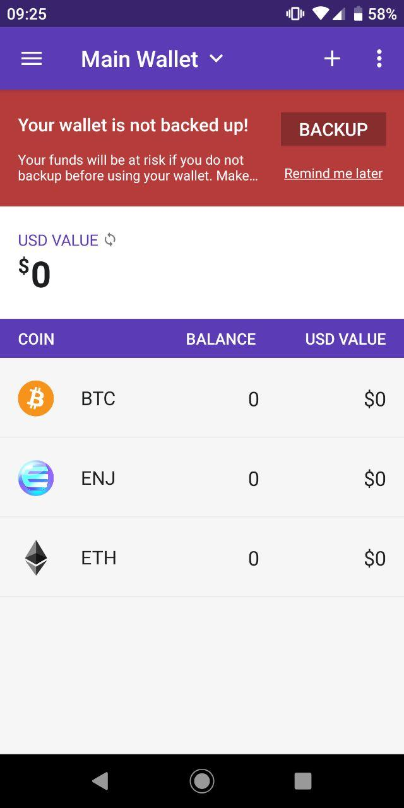

# Connecting Your Enjin Wallet

The Enjin wallet provides an intuitive signing process that makes it easy to execute complex blockchain operations via Enjin's smart contracts.

Most operations that involve a transfer of value, alteration of blockchain data or metadata changes to a token, will need to be authorized via the blockchain, which means an approval request will be sent to your Enjin Wallet.

## Creating your Wallet

### Install the Enjin Wallet App

You can download the latest version of the Enjin Wallet app on both Android [Google Play Store](https://play.google.com/store/apps/details?id=com.enjin.mobile.wallet) and on iOS [Apple Store](https://apps.apple.com/us/app/enjin-cryptocurrency-wallet/id1349078375) for free. 

For Android devices, you can also install the app by [downloading the APK](https://support.enjin.io/help/enjin-wallet-apk). 

You'll need version 1.7.0 or higher in order to use developer mode. Enabling [developer mode](https://support.enjin.io/help/how-to-enable-developer-mode) in the settings section of the Enjin wallet app, is a requirement to communicate with the Enjin Platform.

### Enable Developer Mode
To enable [developer mode](https://support.enjin.io/help/how-to-enable-developer-mode) in the wallet, go to the settings screen and tap on the version number in the bottom right corner **10 times**. As you go through this process, you will receive notification pop-ups indicating "You are now x steps away from being a developer." 

### Create your Wallet
To create your wallet (if not already done) select the Open Wallet option and then select the Create Wallet option.
Accept the Terms and Conditions and create a secure password.

_**Note**: it's imperative to write down, on paper, your 12-word passphrase of your newly created wallet!_

If this is not your first time creating a wallet, tap on the 3 dot menu on the right, tap Manage Wallets, and tap the (+) symbol in the lower right corner of the screen. Then select **Create Wallet**. 

Give your newly created wallet a name of your choosing, such as "Master Wallet" or "My Primary Wallet".

- If you are working on Testnet, select Ethereum (Kovan KETH) and Enjin Coin (Kovan KENJ) for Coins. Then tap the Create Wallet button.
- If you are working on Mainnet, select Ethereum (ETH) and Enjin Coin (ENJ) for Coins. Then tap the Create Wallet button.

You have now successfully created a wallet.

### Backup the Wallet
It is imperative that you take a minute to write down, on paper, your private keys (12 word passphrase) and keep them safe. 

* If you do NOT backup your wallet and your device is lost, you will **NOT** be able to recover your cryptocurrency funds and items. 
* If anyone else gains access to your private keys (12 word passphrase) they will be able to steal your cryptocurrency funds and items.

If you do not know what a recovery phrase is, we recommend you go over this support article [here](https://support.enjin.io/help/recovery-phrase). 

### Get Your Ethereum Address
To find your Ethereum address of your wallet: 
1. Tap on the wallet you wish to view the Ethereum address, from the drop-down menu. 
2. Tap either the ETH or ENJ token (both tokens will follow the same Ethereum address). 
3. Then tap on the Receive button in the top left. 
4. Copy your address.

_NOTE: Your Enjin Coin (ENJ) and all of your blockchain assets are running on Ethereum so they are also managed within the same address._

### Fund Your Wallet

To begin creating and managing your blockchain assets, you need to pay for your necessary blockchain transactions using Ethereum (ETH) and Enjin Coin (ENJ).

Ethereum is used to pay for transaction fees on the network, while Enjin Coin is used to create and back your items. You will be using ETH/ENJ for creating blockchain assets and minting assets 

**Ethereum Mainnet:** To begin transacting on Mainnet, you will need ETH (Ether) and ENJ (Enjin Coin). You can purchase these from a cryptocurrency exchange.

**Kovan Testnet:** To begin transacting on Testnet will need KETH (Kovan Ether) and KENJ (Kovan Enjin Coin). To receive these free resources, go to the [Enjin Kovan Testnet Faucet](https://kovan.faucet.enjin.io/) and input your Ethereum address.

## Wallet Linking

Every user of your Enjin Project or collection requires an app identity that allows you to identify them as the true owner of their Ethereum address.

Identities are distinct from user ids and are a way to decouple users from wallet addresses. Identities are either linked or unlinked. If they are linked, they contain a valid Ethereum address. Unlinked identities have a code like `AXXAZK` that users can sign into their Enjin Wallet to link their Ethereum address and prove that it's theirs.

It is important to know that, **there can only be one identity per user, per app/game.** You cannot directly connect a user id to a wallet.

For example, the user `bob` can link his wallet `0xabcd`to the game `Space Monkies`, but they won't be able to link multiple wallets to that particular game. If `bob` wants to use a different wallet with `Space Monkies`, he will need to unlink the current wallet and re-link with the new wallet.

An identity will automatically be created for new users if you set an app id when creating the user.

### Linking your Wallet

To authorize and sign any transactions, you will need to link your Enjin Wallet app to your identity. 

To do this, you will need to find your **Linking Code**.

You can find the link code with the following query:

[Identities](../examples/Identities.gql)

You should be given a 6 character linking code to enter into your Enjin Wallet app in the **LINKED APPS** section. Mainnet code(s) starts with “A”, while Kovan starts with “B”. You will need to choose which wallet to link (if you have multiple wallets imported).

To reset your linked wallet, you can use the following query:

[UnlinkIdentity](../examples/UnlinkIdentity.gql)

### Approving ENJ
Every time a successful request has been made to the blockchain, you will need to accept and sign the transaction in the REQUESTS section of your wallet.

Since creating transactions will usually cost Enjin Coin or Ether, to prepare for future expenditure you will need to pre-approve the Enjin Smart Contract to create transactions on your behalf.  

When linking your wallet for the first time, an approve transaction will automatically be created for you to sign.  

You need to check the Requests section of your wallet. You will see an **APPROVE ENJ** transaction request. You must accept this  request to allow the Enjin Smart Contract to do its work.

### Setting Approval Limits
By default, your approval transaction value will be set to the maximum amount of ENJ possible.

In GraphQL, the Max approval amount represented is by _-1_ in the _value_ field.

If you wish to change the pre-approval amount, you will need to make sure that you have set the spending approval value to _0_ first, before approving any value that is different from the default. 

[ApproveENJ](../examples/ApproveENJ.gql)

Once you have set the value to _0_ you can proceed to set your Max ENJ spend to whatever amount you want. 

For example _100_ (ENJ) or _1000_ (ENJ). 

This could protect you from accidentally overspending while minting batches of blockchain assets.
