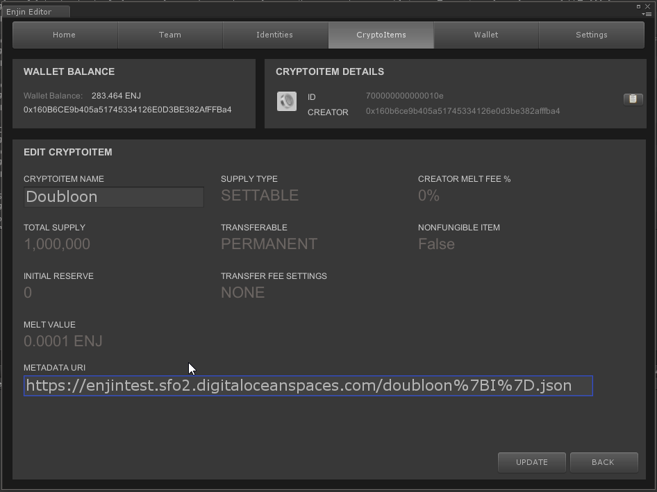

# Working with Metadata

## ERC1155 Metadata JSON Schema

Assets made on the Enjin Platform may contain metadata that is based on the ERC721 Metadata JSON Schema. We are adding an optional formatting standard to this schema to increase efficiency for games that need to manage metadata for thousands of items.

Correctly formatted metadata is used by:
* Enjin Wallet
* EnjinX Blockchain Explorer
* The Game Client / Server via SDKs

### JSON Format
Example:
```json
{
	"name": "Asset Name",
	"description": "Lorem ipsum...",
	"image": "https:\/\/s3.amazonaws.com\/your-bucket\/images\/{id}.png",
	"properties": {
		"simple_property": "example value",
		"rich_property": {
			"name": "Name",
			"value": "123",
			"display_value": "123 Example Value",
			"class": "emphasis",
			"css": {
				"color": "#ffffff",
				"font-weight": "bold",
				"text-decoration": "underline"
			}
		},
		"array_property": {
			"name": "Name",
			"value": [1, 2, 3, 4],
			"class": "emphasis"
		}
	}
}
```
The properties name, description and image follow the ERC721 metadata schema. Values in the properties JSON object will be rendered in client applications (Enjin Wallet and EnjinX).

#### Simple Property
Value must be a string, integer, float, or simple array.

#### Rich Property
Must be an object containing:
* Required Properties:
  * value
    * string, integer, float, or simple array
* Optional Properties
  * name
  * display_value
  * class
  * css

#### Arrays
The value field may be a simple array of strings, ints, or floats. These will be displayed in table form in the client application.

### Specific Metadata URI
Any token ID may have a metadata URI that can be retrieved by calling uri(_id) on the ERC-1155 contract.

If an individual Non-Fungible token ID has a metadata URI defined, client apps should use this URI. If not defined, client apps should call uri(_id) on the base token id to retrieve the Default URI for the entire set of Non-Fungible tokens.

### Default URI
A Non-Fungible token that defines a Default URI in its base token has the option of using an {id} placeholder in the URI itself. This will get replaced with the distinct ID when accessing NF items.

Example:
```
yoursite.com/{id}.json
->
yoursite.com/0xbd4818c04f57a2ebc473d74ee06d6e0600000000000000000000000000000001.json
```

### Images
If the Default URI contains an image property that in turn contains the {id} placeholder, the image url will be used as the default image for all tokens of this type.

Example:
```
yoursite.com/images/{id}.jpg
->
yoursite.com/images/0xbd4818c04f57a2ebc473d74ee06d6e0600000000000000000000000000000001.jpg
```

The **image** property can also be a static URI without the placeholder, as desired.

## Hosting Metadata

This guide will show you how to host JSON metadata and images for your items
using [Digital Ocean](https://enj.in/digital-ocean) Cloud Services. This is not the only
way to host your data, but should provide an easy, yet robust way for developers that
are less familiar with web technologies to fully take advantage of item metadata.

You can look at the full JSON schema for metadta over [here](./erc1155_metadata_json_schema.md).

### Getting Started
Create an account on Digital Ocean.

Once you have an account, create an new
project for you game, and then create a [Space](https://www.digitalocean.com/docs/spaces/).

Your screen should look something like this:


### Uploading Files
Click on the Space to access.

Upload your images first, since you will need to set the `image` field in your JSON to the URL of you image.

Set permissions to Public.

Modify your JSON data to point to the appropriate images on like so:

```json
{
  "description": "Hello from Digital Ocean!",
  "image": "https://enjintest.sfo2.cdn.digitaloceanspaces.com/shcmeckle_export.png",
  "properties": {
    "Quality": "Common"
  }
}
```

Upload your finished JSON to the Digital Ocean Space. It should look something like this:


### Setting URIs and Testing

In Unity, select the item and hit EDIT. Fill in the URI field.



In the Platform API (GraphQL), you can set the URI for the item like so:

[CreateToken](../examples/CreateToken.gql)

Note that in either case setting the URI is a blockchain transaction that you will need to approve.
