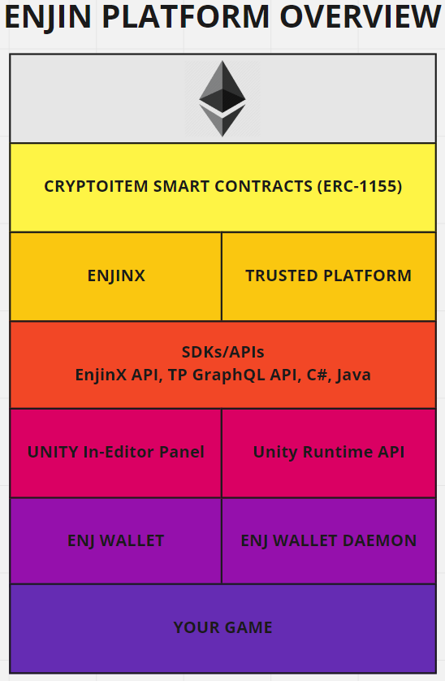
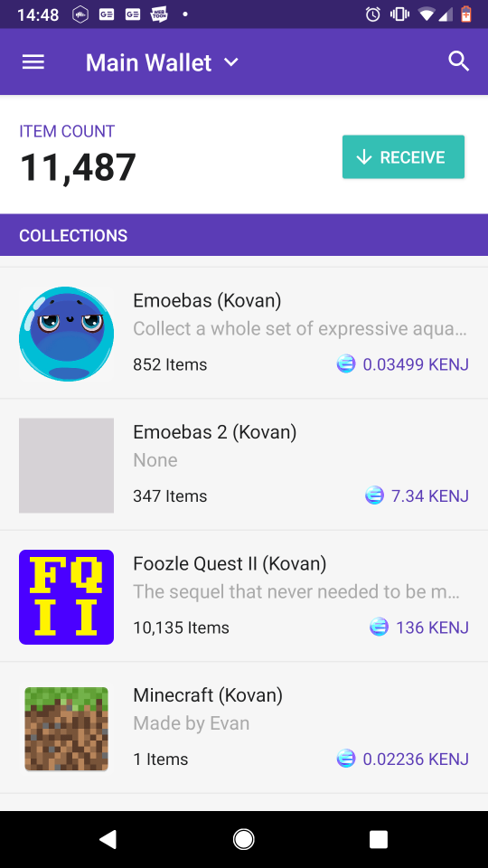

# Platform Overview

## What is Enjin Coin (ENJ)?
The easiest way to get the idea of ENJ is to pretend that it is a real world
material, like steel. Steel is used to make all sorts of useful
items in the real world, from weapons, nuts and bolts, to unique pieces of art.
Steel can also be bought, sold and traded with others at various markets.

ENJ is digital steel. ENJ can be bought, sold, and traded on exchanges.
ENJ can be used to make a million bullets, or to cast a one of kind sculpture. The possibilities are really only limited by your imagination.

## Why would I use ENJ?
Digital steel, so what? I can make a billion bullets in my game in 1 second my stubby sausage fingers! I don't need a digital version of a real world concept in my game! Absurd!

Well, making things with ENJ is just the start. Think again of the real world,
and pretend the sword you have forged with ENJ is a real world object. What would be
the benefits to you as a creator? As a player? Here are a few:

* You created the sword from a material, therefore it has some value, however small.

* If you make 100 swords, that's how many there are in the world. There is a finite
number of them in existence. That's supply.

* If you have something of value and it has supply, you can expect demand for that item.
The demand might be small or large, it depends on the item, how it works in your game,
and what players are willing to pay for the item.

* Player who buy your sword really own it, you and your game could go offline tomorrow
and they would still have it.

* People can trade items with each other, without needing you to know about it. Actually
ENJ is better than the real world in this case because you, as the creator, can charge
a small fee every time one of your items moves from person to person!

* People can recycle items by melting them back in ENJ, allowing them to re-invest
ENJ into new games that they want to play.

These are just a few benefits at it's core, if you want a more extensive overview of
the of digital items check out this [video](https://www.youtube.com/watch?v=7KLpNU6wXEM).

## The ENJ Stack
Assuming you're still here, I'll now assume that you are a game developer of some sort with a basic understanding of how cryptocurrencies, in particular Ethereum, work. One of the main
benefits of ENJ is that is __all__ the knowledge you'll ever need. You will not need to learn how
to code smart contracts, set up a Parity node, or know how consensus algorithms work. We do that for you so you can focus on the thing really matters, __your game__.

Look at this picture:

### Ethereum
Starting from the top (or maybe the bottom?) is the open-source, public, blockchain based distributed computing platform called [Ethereum](https://en.wikipedia.org/wiki/Ethereum). This is where the magic happens; Vitalik's spaceship. This is the future people: the new internet, it's just not widely distributed yet as old Bill Gibson says. You only really need to know some basic concepts about Ethereum to make your way around the ENJ platform, and you can learn those as you go. Let's move on.

### ERC1155 Smart Contracts
Smart Contracts are programs that run on the Ethereum "operating system". They are much like regular programs, and act as the low level building blocks that platforms like ENJ use to build their functionality. Enjin has championed a standard called [ERC-1155](https://github.com/ethereum/eips/issues/1155), proposed by Witek Radomski and the blockchain team here at Enjin. ENJ uses an implementation of ERC-1155 as the basis for the platform's functionality. You don't need to know anything about smart contracts or how to program them to use ENJ, we do all the heavy lifting here for you.

### Trusted Platform
The Trusted Platform is the main backend service of ENJ that connects your game to the Ethereum network. The TP acts as a hub, gathering requests from clients and game servers, interacting with the smart contracts on Ethereum, and returning data back to your game.

Currently, we are using a cloud based solution to host the Trusted Platform for you, so you don't need to worry about setting up things yourself, all you need is an account and a subscription. In the future, we will be offering ways for developers to run their own self hosted TPs.

### SDKs and APIs
The most basic way to talk to the Trusted Platform is by using our [GraphQL API](https://graphql.org/learn/). If you can use HTTP from you game to talk to a web service, you'll be able to talk to your trusted platform via this interface.

### Editor Tools and Runtime APIs
Over time our team of Enjineers will be creating all sorts of tools and APIs for all of the most frequently used game technology out there. For now, the focus is on the Unity engine. We provide a Unity API, and an in-editor UI Panel built right into the editor to help you do the most common operations with the ENJ platform. If you are not using Unity, you'll want to back up one level and use the GraphQL API for you game.

### ENJ Wallets
One concept that takes a bit of getting used to when working with the blockchain is the idea of having a wallet address a private key. Think of your wallet address as the street address for your garage of stuff. But it's more than that, because each garage comes with a private key. The private key is solely controlled by the wallet owner, YOU! You use your private key to access the contents of your wallet, but also to authorize and sign transactions that are happening with your items. For most players and some developer tasks, like creating items, you'll probably use the Enjin wallet mobile app for Android and iOS. For your game itself, you'll want to use the Enjin Wallet Deamon to automate most of these operations in a secure and convenient way.

### YOUR GAME
Which brings up to the bottom of the stack, where the rubber meets the road, your GAME! The nice thing about our platform is that it is not an all or nothing thing, you can choose how deeply you want to integrate ENJ into you game, over as long of a period as you wish. Maybe start with a vanity item or achievement token that is given to players upon purchase or completion of your game.

# How do I get started?

  Still here? Great! We'd love to have you! You can get up and running on our platform in therefore
  easy steps.

  1. Sign up and subscribe [HERE](https://portal.tp-enj.in/). This will give you access the Trusted Platform (and Platform API).

  2. You'll then need to create at least one wallet. You have multiple options here: if you are just starting out with the platform and if you think you will be doing a low number of operations and want to get a feel for how things work manually, grab the mobile wallet off the [iOS app store](https://itunes.apple.com/us/app/enjin-cryptocurrency-wallet/id1349078375?mt=8) or the [Google play store](https://play.google.com/store/apps/details?id=com.enjin.mobile.wallet&hl=en_US).
  The mobile wallet is also handy for watching server side wallets that you want to keep an eye on.

  If you are doing a high number of transactions, or need to automate transaction signing for game severs interacting with players, you should use our wallet daemon. Check out our [wallet daemon guide](./wallet_daemon_guide.md) for how to get started with that.

  Wallets need ETH to pay for transactions, and ENJ as the digital casting material to create your items. If you want to experiment our Kovan testnet sandbox before using real currencies you can get some KENJ and KETH from our faucet [HERE](https://faucet.enjin.io/) and be off to the races.
  If you want to use real deal, mainnet, you will need actual ETH and ENJ via an exchange.

  3. Finally, you need to decide how you are going to interact with the ENJ platform. You'll probably use all of these platform interfaces at one time or another.
    * If you are a Unity developer, you can use the Unity SDK, which is free on the Unity
    asset store. Guide is [here]().
    * You can work with the Platform API via browser based GraphiQL console. Guide is [here]().
    * You can use node to work with the Platform API directly, a guide is [here]().
