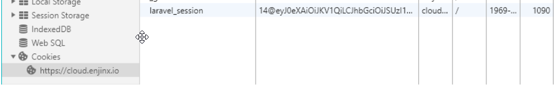

# Trusted Platform Guide (GraphiQL)
There are two separate TP servers, Kovan and Mainnet.

You can use the following GraphiQL browser interface to interact with the Trusted Platform:

* Kovan Trusted Platform (GraphiQL): [https://master.tp-enj.in/graphiql](https://master.tp-enj.in/graphiql)
* Mainnet Trusted Platform (GraphiQL): [https://cloud.enjin.io/graphiql](https://cloud.enjin.io/graphiql)

## Browsing the Schema
On the right-side there should be a documentation panel to expand and browse for all the requests
and parameters you can use.

## Making a Request
On the (top) left panel, you would enter in your request to be made to the TP. Press the “Play” button at the top to submit that request, and you will receive a response on the right panel, sometimes a notification will appear in your dev wallet to sign a transaction depending on the request made.

## Creating Your User
Go [HERE](https://portal.tp-enj.in/) to create a user on the platform if required.

If that does not work, please provide the email address you wish to create a user with to [someone on the Enjin Team] to create a user account for you. You can update your user login once you have your access token.

You should be given: User ID, Name, Email, Password.

If you have an admin user account on an app, you can create additional users by using the request, replacing with login details.

```
mutation {
  CreateEnjinUser (
    name: "USERNAME",
    email: "EMAIL",
    password: "PASSWORD"
  ) {
    id
    name
    email
  }
}
```
_Accounts are not shared between Kovan & Mainnet TP servers. You will need an account on each server if you want to use both platforms._

## Authenticating Your Requests

In your browser, [Chrome Instructions] open DevTools (F12), navigate to the **“Application”** tab, expand **“Cookies”** on the left panel and select the website. Create a new cookie called “laravel_session” and enter in `<app_id>@<access_token>` substituting in your App ID and Access Token. If you do not have an app yet, you can enter in your Access Token without `<app_id>@`. You can now also send the app_id in as a separate cookie/header called `X-App-Id`. If sending the app_id separately then you don't need to prefix it to the access_token.



## Updating Your User Login
Once you have set up your **laravel_session** cookie. You can update your user name, email, and password by running the following request. Replacing with your User ID, new name, new email and new password.

```
mutation {
  UpdateEnjinUser (
    id: USER_ID
    name: "NEW NAME",
    email: "NEW EMAIL",
    password: "NEW PASSWORD"
  ) {
    id
    name
    email
  }
}
```

## Creating Your App
You will need to create your own App on the Trusted Platform. This will appear as one of the “collections” where your items will appear in the user’s wallet.

```
mutation {
  CreateEnjinApp (
    name: "Doge",
    description: "Much apps. Such wow.",
    image: "/doge.jpg"
  ) {
    id
    name
    description
    image
  }
}
```
You will need a name, description and a link to a hosted image for your app. You should get the App ID in the response if it was successful. You can now use this App ID in your `laravel_session` cookie, `<APP_ID>@<ACCESS_TOKEN>`.

## Linking Your Wallet

To accept and sign any transactions, you will need to link your Enjin Wallet (Dev version) app to your App Identity. To do this, you will need to find your **Linking Code**.
```
query {
  EnjinIdentities (
    pagination: {
      page: 1,
      limit: 50
    }
  ) {
    id
    app {
      name
    }
    linking_code
    enj_allowance
    ethereum_address
  }
}
```
You should be given a 6 character linking code to enter into your dev wallet app in the **LINKED APPS** section. Mainnet code starts with “A”, while Kovan starts with “B”. You will need to choose which wallet to link (if you have multiple wallets imported).

To reset your linked app, use the following query and replace the id with your identity_id. You can find this by using the query above.
```
mutation {
  DeleteEnjinIdentity (
    id: identity_id,
    unlink: true
  ) {
    linking_code
  }
}
```
## Approving ENJ
To prepare for item creation, you will need to pre-approve ENJ to the CryptoItems smart contract. You will need to make sure you have set approval to 0 first before approving your actual value. You do not need to multiple value by 10^18 for this request. You don’t need to do this if you already have previously approved a sufficient amount of ENJ to use.

```
mutation createTokenRequest {
  CreateEnjinRequest (
    identity_id: 1,
    type: APPROVE,
    approve_enj_data: {
      value: 0
    }
  ) {
    id,
    encoded_data
  }
}
```
Once a successful request has been made, you will need to accept and sign the transaction in the **NOTIFICATIONS** section of your dev wallet.

## Creating an Item

To create a token, you will need to make a request with various token data.

```
mutation createTokenRequest {
  CreateEnjinRequest (
    identity_id: 1,
    type: CREATE,
    create_token_data: {
      name: "ITEM_NAME",
      totalSupply: 100,
      initialReserve: 50,
      supplyModel: FIXED,
      meltValue: "15000000000000000000",
      meltFeeRatio: 1250,
      transferable: PERMANENT,
      transferFeeSettings: {
        type: PER_TRANSFER,
        token_id: "0",
        value: "1000000000000000000"
      }
      nonFungible: false
    }
  ) {
    id,
    encoded_data
  }
}
```

Property | Descriptions
---|---
totalSupply | Total Supply for the item
initialReserve | Initial Reserve for the item. You will need ENJ approved for this reserve.
supplyModel | Supply Model for the token. FIXED, SETTABLE, INFINITE, COLLAPSING, ANNUAL_VALUE, ANNUAL_PERCENTAGE.
meltValue | ENJ value of the token. Need to multiply value by 10^18 to include 18 decimals.
meltFeeRatio | Percentage of melt value returned to the creator, up to 2 decimals. Need to multiply the percentage by 100.
Transferable | Transfer Type. PERMANENT, TEMPORARY, BOUND.
transferFeeSettings - type | Transfer Fee Type. NONE, PER_TRANSFER, PER_CRYPTO_ITEM, RATIO_CUT, RATIO_EXTRA, TYPE_COUNT.
transferFeeSettings - token_id | Token ID of the token you want to use as the transfer fee. Use 0 for Enjin Coin.
transferFeeSettings - value | Value of the transfer fee. If using ENJ, multiply the value by 10^18 to include 18 decimals.
nonFungible | Whether the token is Non-Fungible or Fungible, true or false.

Once a successful request has been made, you will need to accept and sign the transaction in the **NOTIFICATIONS** section of your dev wallet.

## Finding the Token ID (and Additional Details)
You can either find the Token ID on the transaction with that token after it confirms via etherscan or you can search for the item on the Trusted Platform, you will need to wait for it to be confirmed and scraped from the blockchain first.

```
query {
  EnjinTokens (
    name: "ITEM_NAME",
    pagination: {
      page: 1,
      limit: 50
    }
  ) {
    token_id
    name
    creator
    meltValue
    meltFeeRatio
    meltFeeMaxRatio
    supplyModel
    totalSupply
    circulatingSupply
    reserve
    transferable
    nonFungible
    blockHeight
    markedForDelete
    created_at
    updated_at
    availableToMint
    itemURI
  }
}
```
Enter in the item name to search for that item. Alternatively, you can make the request without the name parameter to return all items on your TP App.

## Setting the URI (Item Metadata)
In order to link an item to a metadata file, you will need a .json file hosted somewhere that has public read access. You can include a name (which would be displayed instead of the blockchain item name), description, and link to an image (which also needs to be publicly readable) in the .json file.
```
{
  "name": "ITEM_NAME",
  "description": "Description line 1.\nDescription line 2.",
  "image": "/IMAGE.jpg"
}
```
Once you have that .json file uploaded with public read access, you can make the request to set the item URI. Replacing with your token_id and link to your .json file.
```
mutation createTokenRequest {
  CreateEnjinRequest (
    identity_id: 1,
    type: SET_ITEM_URI,
    set_item_uri_data: {
      token_id: "TOKEN_ID",
      token_index: 0,
      item_uri: "/METADATA.json"
    }
  ) {
    id,
    encoded_data
  }
}
```
Once a successful request has been made, you will need to accept and sign the transaction in the “NOTIFICATIONS” section of your dev wallet.

## Minting the Token`
The request for minting fungible tokens (FTs) vs non-fungible tokens (NFTs) may vary slightly. You can batch mint to multiple addresses if you wish to do so. The differences are that if you need to mint multiple NFTs, you will need to specify the wallet address for each individual token. Ideally try to avoid minting over 100 NFTs in a single transaction, FTs do not have this restriction. Here is the same request between 2 different tokens types, FT and NFT.

**FT:**
```
mutation createTokenRequest {
  CreateEnjinRequest (
    identity_id: 1,
    type: MINT,
    mint_token_data: {
      token_id: "TOKEN_ID",
      recipient_address_array: [
        "WALLET_ADDRESS_1","WALLET_ADDRESS_2"
      ]
      value_array: [
        5,3
      ]
    }
  ) {
    id,
    encoded_data
  }
}
```
This request would mint 5x tokens to “WALLET_ADDRESS_1” and 3x tokens to “WALLET_ADDRESS_2”.

**NFT:**
```
mutation createTokenRequest {
  CreateEnjinRequest (
    identity_id: 1,
    type: MINT,
    mint_token_data: {
      token_id: "TOKEN_ID",
      token_index: "0",
      recipient_address_array: [
        "WALLET_ADDRESS_1","WALLET_ADDRESS_1","WALLET_ADDRESS_1","WALLET_ADDRESS_1","WALLET_ADDRESS_1","WALLET_ADDRESS_2","WALLET_ADDRESS_2","WALLET_ADDRESS_2"
      ]
    }
  ) {
    id,
    encoded_data
  }
}
```
This request would mint 5x tokens to “WALLET_ADDRESS_1” and 3x tokens to “WALLET_ADDRESS_2”.

Once a successful request has been made, you will need to accept and sign the transaction in the “NOTIFICATIONS” section of your dev wallet.
