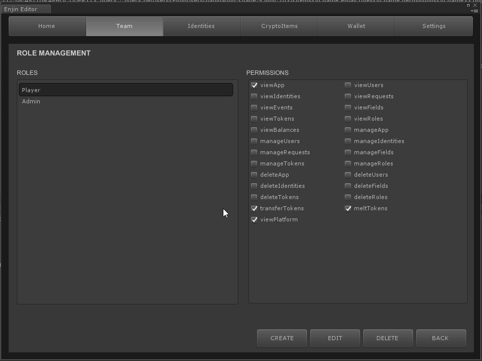

# Unity Quickstart

## Before You Start

Before you start working with Unity, you'll need a Trusted Platform account.
See [here](./starthere.md) about getting one.

Also, you won't be able to do much without ENJ or ETH (or KENJ/KETH if on Kovan)
so make sure you are stocked up before doing anything beforehand.

Lastly, it helps to think about your item economy before you do any large scale
minting of items. Test your items out on our Kovan sandbox before moving onto mainnet.
Working with crypto items involves using real money and transaction fees, and it's
best to know what you are getting into beforehand.

## Setup

Setup into Unity is easy. Grab the Enjin Blockchain Asset off the Unity Asset Store
with you open game project in Unity. If you got the package from somewhere else
import into using via Assets->Import Package->Custom Package.

Access the Unity panel via **Window->Enjin SDK**.

## Home Screen (Logged Out)

#### Select Platform

Use Select Platform to choose what platform you want to work with. You have 3 choices:
* Kovan Testnet - Our primary testnet sandbox.
* EnjinX Platform - Our primary mainnet platform.
* Custom Platform - Specify the URL to a custom platform.

#### Login
Right now, accounts are platform specific, so if you are having trouble logging in
make sure you are using the right credentials for your account.

### Home Screen (Logged In)

When logged in, your home screen is where you can review your login information, but is also where you manage you apps. You are going to want to have one app per game.  Click **Create App** button to add the app to you platform. You can set the name, image URL and description of the app in the fields. Make sure the image is publicly accessible for it to show up in the wallet. Use the app drop down to select the app you want to work with for this session, and **Edit App** if you made any mistakes entering you apps.

## Team Screen

The team screen is where you create, edit and remove team members from your app. You can also see player accounts that have been added to your app as people are playing.

To create a player, click **Create Player**. Enter a username, password, and role for this user.

To edit an existing user, click **Edit** while the given user is selected.

You can search for users using the **Search** box.

Roles are way for you to control access and permissions for various operations in your app. You can **Create**, **Edit** and **Delete** roles depending on the needs of you game. In general, you'll have two roles: one for the Admin (you!), with permission to do anything, and one for regular players, who generally have a much smaller set of permissions.

**TODO:** How to create a new team member. EDT-1960.

## Identities Screen

The identities screen is where you link user accounts to ethereum addresses. You are only
allowed to have one identity per user, per app. That means a user can have many identities across a variety of apps in the ecosystem.

Identities can be in one of two states: linked or unlinked. A linked identity will show a valid
public ethereum address, and unlinked address will show a six digit alphanumeric linking code.

The linking code is used by developers to link their mobile or wallet daemon to your app to do things like creating and distributing items.

The linking code is used by players to link their account and wallet to your game via the platform.

## Cryptoitems Screen

## Wallet Screen

## Settings Screen
