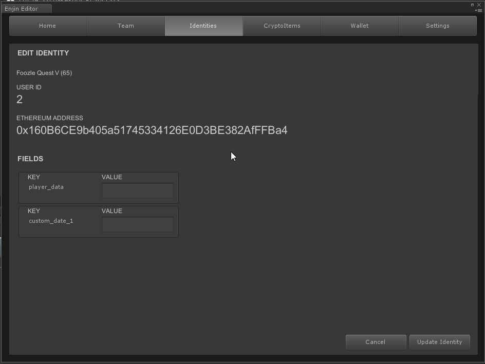
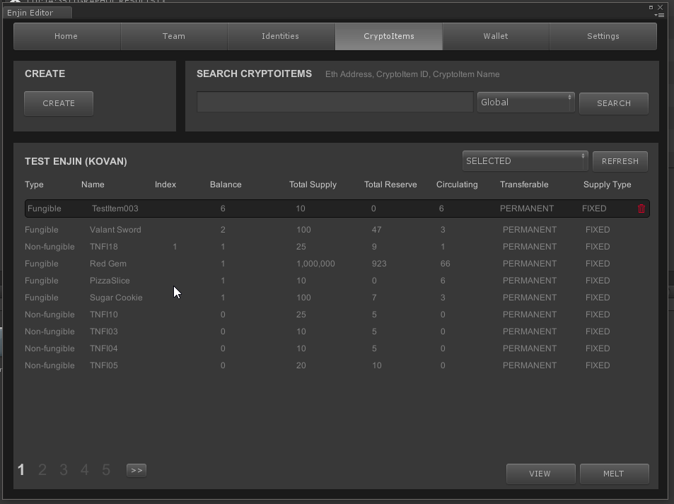
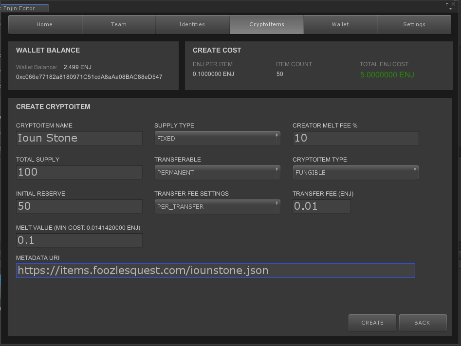
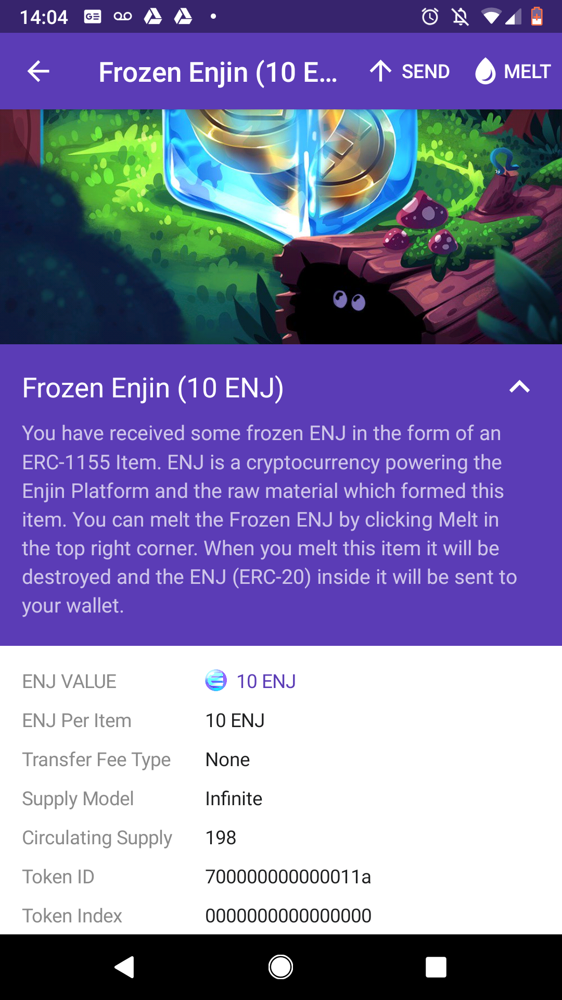

# Unity Quickstart

## Before You Start

Before you start working with Unity, you'll need a Trusted Platform account.
See [here](./starthere.md) about getting one.

Also, you won't be able to do much without ENJ or ETH (or KENJ/KETH if on Kovan)
so make sure you are stocked up before doing anything beforehand.

Lastly, it helps to think about your item economy before you do any large scale
minting of items. Test your items out on our Kovan sandbox before moving onto mainnet.
Working with crypto items involves using real money and transaction fees, and it's
best to know what you are getting into beforehand.

## Setup

Setup into Unity is easy. Grab the Enjin Blockchain Asset off the Unity Asset Store
with you open game project in Unity. If you got the package from somewhere else
import into using via Assets->Import Package->Custom Package.


Access the Unity panel via **Window->Enjin SDK**.

## Home Screen (Logged Out)


#### Select Platform

Use Select Platform to choose what platform you want to work with. You have 3 choices:
* Kovan Testnet - Our primary testnet sandbox.
* EnjinX Platform - Our primary mainnet platform.
* Custom Platform - Specify the URL to a custom platform.

#### Login
Right now, accounts are platform specific, so if you are having trouble logging in
make sure you are using the right credentials for your account.


### Home Screen (Logged In)


When logged in, your home screen is where you can review your login information, but is also where you manage you apps. You are going to want to have one app per game.  Click **Create App** button to add the app to you platform. You can set the name, image URL and description of the app in the fields. Make sure the image is publicly accessible for it to show up in the wallet. Use the app drop down to select the app you want to work with for this session, and **Edit App** if you made any mistakes entering you apps.

## Team Screen


The team screen is where you create, edit and remove team members from your app. You can also see player accounts that have been added to your app as people are playing.

To create a player, click **Create Player**. Enter a username, password, and role for this user.

To edit an existing user, click **Edit** while the given user is selected.

You can search for users using the **Search** box.


Roles are way for you to control access and permissions for various operations in your app. You can **Create**, **Edit** and **Delete** roles depending on the needs of you game. In general, you'll have two roles: one for the Admin (you!), with permission to do anything, and one for regular players, who generally have a much smaller set of permissions.

**TODO:** How to create a new team member. EDT-1960.

## Identities Screen


The identities screen is where you link user accounts to ethereum addresses. You are only
allowed to have one identity per user, per app. That means a user can have many identities across a variety of apps in the ecosystem.

Identities can be in one of two states: linked or unlinked. A linked identity will show a valid
public ethereum address, and unlinked address will show a six digit alphanumeric linking code.

The linking code is used by developers to link their mobile or wallet daemon to your app to do things like creating and distributing items.

The linking code is used by players to link their account and wallet to your game via the platform.



You can enter custom data (for example Minecraft player UUID) to attach to an identity, too!

## Cryptoitems Screen


The Cryptoitems screen is the heart of the Enjin Unity SDK. This is the main screen where you create and manage your items. Before we get into the details of the process, you should know a couple of
things.

#### Creation of an item is two step process:

1. First you need to **CREATE** the item. This is like crafting a cookie cutter for your cookies you
will be making.

2. Then, you need to **MINT** the item. Minting the item uses the cookie cutter to punch out some cookies.

#### There are two types of items: Fungible Items and Non Fungible Items.
* **Fungible Items** are all identical and can be considered essentially interchangeable. Gold coins,
rusty swords, ingots etc. would fall under this category. Using our cookie analogy all the cookies
would look the same. If we traded fungible cookies and mixed the cookies up, we would not be able to tell which cookie we used to trade with.

* **Non Fungible Items** are all unique items that come from a common base item. Using our
cookie analogy, it would be like decorating every cookie with a unique icing pattern. While all
the cookies share the same base, they are not considered interchangeable because of their unique
patterns. If we traded non-fungible cookies we would easily be able to identify which cookies
we traded.

There are some key workflow differences between fungible and non-fungible items  

#### Creating items


When you click **CREATE** on the main panel you will be brought to the the Create Cryptoitem panel.

In the top left, you'll be able to see what wallet you are using, and the ENJ balance you have in
that wallet. If you need to change wallets, you can unlink the current wallet and link the wallet
you want to use for you create operations.

The main panel is where you determine the characteristics of your item. Let's talk about each one
of them:

**CryptoItem Name**: Should be self explanatory. Make it good!

**Total Supply**: This is how many of the item you want to exist in the world. This limit can be
broken or mean different things depending on the supply model you use above. For example, if you
use the COLLAPSING supply type, the initial supply would represent the total number of items that
existed during the original run. The easiest to understand is FIXED, which tells users that there
can only be "this many" items of this kind in existence at any one time.

**Initial Reserve**:This is how many items you want to pre-pay to mint as part of the initial create operation. Minting items will be deducted from this balance until it is exhausted. You have to
pay for at least one item on creation. Having an initial reserve allows you to create your item without having to spend all the ENJ for your total supply on the create.

**Melt Value**
The amount of ENJ you want to use per unit of item you are creating. You need to use a minimal
amount of ENJ to back your items depending on how many you are creating in your initial reserve (the min cost will be listed beside the label). In general, the more items of one type you are making, the less ENJ you need **per unit** of item.

**Metadata URI**
See **Working with metadata** section.
The metadata URI allows you to add a URL that contains a JSON that describes additional properties of your item.

**Supply Type**: This is how the item pool behaves with respect to minting and melting. We have the following supply types in the current version on Enjin:
  * **Fixed**: You can have this number of items in circulation at one time.
  * **Settable**: Allows you to edit the total supply at any time.
  * **Infinite**: You can mint as many items as you want, exceeding Total Supply.
  * **Collapsing**: Once melted the items cannot be re-minted.

**Transferable**
Determines if items are able to be traded, or are bound to their owners (i.e. non-tradable).
* **PERMANENT**: Item is always able to be traded with others.
* **BOUND**: Item is always bound to the owner of the item.
* **TEMPORARY**: Item is currently tradable, but creator can make it non-tradable at a future date.

**Transfer Fee Settings**
* **NONE**: No Transfer fees are charged when this item changes hands.
* **PER_CRYPTO_ITEM**: Transfer fee per item changing hands.
* **PER_TRANSFER**: Transfer fee per *transfer* when changing hands.
* **RATIO_CUT**: A % cut of the total is subtracted from the tota for the devl, with the sender paying the total price. For example, if transferring 500 gold with a 10% ratio cut (0.1) the recipient would get 450 gold and the dev 50 gold, with the sender paying 500 total for the transaction.
* **RATIO_EXTRA**: A tax that is charged ON TOP of of everything. For example if transferring 500 gold with a 10% ratio extra the recipient would get 500 gold, the dev 50 gold, and the sender pays 550 gold total for the transaction.
* **TYPE_COUNT**: Not used in v1.

**Token ID**
Need to remove this from the screen.

**Transfer Fee(ENJ)**
The transfer fee, in ENJ, based on your setting above.

**Melt Fee Ratio**
This is the current percentage of ENJ that the player will received upon melting the item. The remaining ENJ goes to the creator.

**Icon**
To be removed. We do icons in metadata now.

**NONFUNGIBLE ITEM**
Are you creating a fungible, or non-fungible item.

### Item Creation Example

#### Non-Fungible Item Considerations

#### Working with Metadata
Here is the format:

```
{
	"name": "Asset Name",
	"description": "Lorem ipsum...",
	"image": "https:\/\/s3.amazonaws.com\/your-bucket\/images\/{id}.png",
	"properties": {
		"simple_property": "example value",
		"rich_property": {
			"name": "Name",
			"value": "123"
			"display_value": "123 Example Value"
			"class": "emphasis",
			"css": {
				"color": "#ffffff",
				"font-weight": "bold",
				"text-decoration": "underline"
			}
		},
		"array_property": {
			"name": "Name",
			"value": [1,2,3,4]
			"class": "emphasis"
		}
	}
}
```
You can view an example [here](https://master.tp-enj.in/storage/json/3800000000000004.0.json).

This data can be hosted anywhere. TODO: What about IPFS?

Properties will be used by the wallet to display



## Wallet Screen

## Settings Screen
