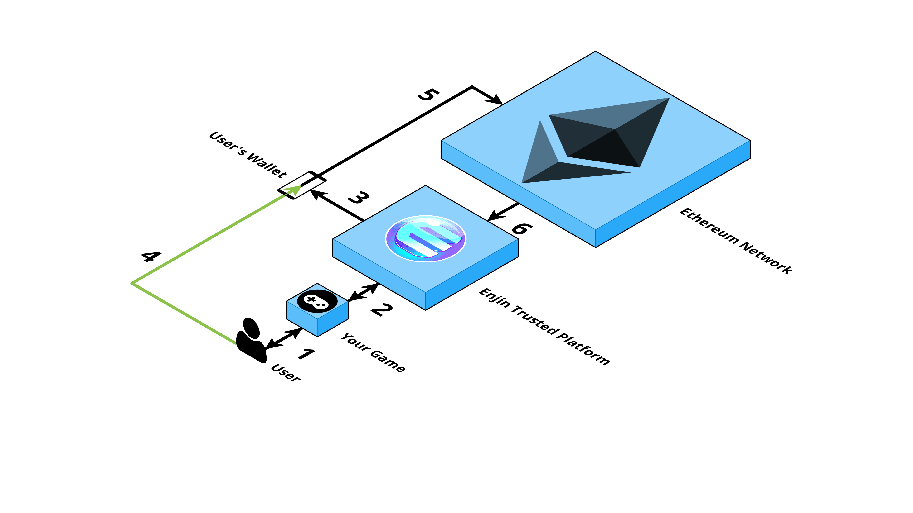

# Platform Architecture

Managing a live blockchain game requires a robust ecosystem of architecture that is in constant communication with the Ethereum Network.

As this diagram shows, a basic blockchain interaction is a simple six-step process. 

In this example, let's consider the case of a user trying to sell a sword:
1. The user interacts with your game. They tell the game to sell a sword.
2. Your game issues a web request to Enjin's Trusted Cloud. The request tells Enjin to remove the sword from the user's inventory.
3. The Trusted Cloud sends a transaction request to the user's Enjin Wallet app. The requested transaction is one that would remove the sword.
4. The user has the choice to either accept or deny the transaction request using their app.
5. If the user accepts, the transaction is broadcast to the Ethereum network. Enjin's smart contract handles all the logic for actually operating on the user's inventory. In this case, the user has accepted and our smart contract handles removing their sword.
6. The Trusted Cloud listens to Ethereum to see if the user's transaction was a success. The resulting transaction data is then sent from the Trusted Cloud back to your game, where you can choose how to display it to the user. In this case, you would show the user that their sword has been removed and reward them with some gold.

## Smart Contract

Enjin's smart contract is responsible for executing transactions (commands) via the Ethereum Network on your behalf.

It is the core piece of on-chain infrastructure that creates, augments, and transacts your game's blockchain inventory.

Functions include:
- Minting blockchain assets (tokens)
- Melting blockchain assets
- Customizing token data and metadata
- Sending tokens between addresses (including yours and your users')

## Trusted Cloud

Trusted Cloud is the main backend service of the Enjin Platform. It is a cloud-hosted service that connects games to the Ethereum blockchain. 

Trusted Cloud acts as a hub, gathering requests from clients, game servers, and the Enjin Wallet, interacting with Enjin's smart contracts on Ethereum, and returning data back to the game. It also manages the link between users’ game accounts (e.g., SteamID, Xbox Live) and their blockchain identity (e.g., currently linked blockchain wallet address).

To save you having to build logic for interacting with our smart contract or the Enjin Wallet app directly, we provide a server that includes a convenient Application Programming Interface (API) to facilitate communication.

The Trusted Cloud includes better error handling and input validation than directly interacting with our smart contract would allow. It also pushes notifications about a given transaction's state to your game.

There are two separate Trusted Cloud servers: **Testnet** and **Mainnet**.

**Testnet** is an Ethereum test network where Ethereum and Enjin Coin do not carry any value and it’s easy to obtain any amount of either. Thus, the Testnet offers an inexpensive way for you to prototype and test out your creations before taking them to production.

**Mainnet** is the real Ethereum network—transactions on it cost real cryptocurrency. You should be very comfortable with your implementation on Testnet before doing anything on Mainnet.

## Platform API (GraphQL)

Your game can communicate with the Trusted Cloud using the [GraphQL query language](https://graphql.org/learn/). 

GraphQL is a query language for APIs and a runtime for fulfilling those queries with your existing data. GraphQL provides a complete and understandable description of the data in your API, gives clients the power to ask for exactly what they need and nothing more.

## Enjin Wallet

Every user has their own unique blockchain address and all transactions to be executed on the blockchain need to be signed (authorized) using that user's private keys. 

The Enjin wallet provides a seamless signing process that makes it easy to execute complex commands via Enjin's smart contracts.

If you are unsure on how to get started with the Enjin Wallet, we highly recommend going through our [connecting your Enjin Wallet](./connecting-wallet.md) guide for further information. 

## Wallet Daemon

The Wallet Daemon is a tool that you can use to automate the authorization of transaction requests to and from the Trusted Cloud.

Without the Wallet Daemon, you would need to sign every in-game blockchain transaction via the Enjin Wallet (e.g., sending a sword to a player).

Wallet Daemon manages an Ethereum address linked to a Trusted Cloud identity. When a transaction is submitted on the Trusted Cloud, the Wallet Daemon receives that transaction, signs it, and sends it back to the Trusted Cloud.

Currently, only a console version of the Wallet Daemon is available. In the future, we will likely create a simple graphical user interface to make it easier for you to use.

If you are in need of further assistance regarding the Enjin Wallet Daemon, we highly recommend checking out our [Wallet Daemon](./wallet_daemon.md) set of guides.
